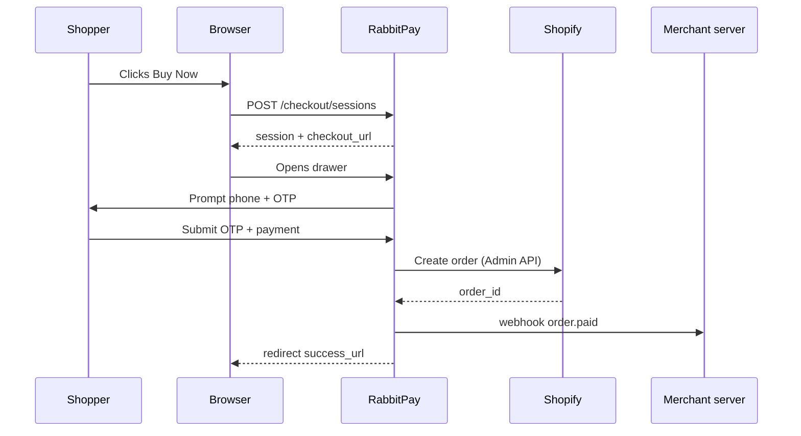

The RabbitPay checkout is designed to complete a purchase in **under 7 seconds** for returning shoppers and **under 30 seconds** for first-time shoppers.

## The five stages

<Steps>
  <Step title="Trigger">
    Shopper clicks the **Buy Now** button (Shopify theme extension) or a custom trigger you wire up via `rabbitpay.checkout.open()`.
  </Step>
  <Step title="Identify">
    RabbitPay's drawer opens and asks for a mobile number. If the number matches a saved shopper, addresses and payment tokens are pre-loaded.
  </Step>
  <Step title="Verify">
    A 6-digit OTP is sent via SMS (with WhatsApp fallback). Verified sessions are tied to the device for 30 days.
  </Step>
  <Step title="Pay">
    Shopper picks a payment method — UPI, cards, wallets, netbanking, EMI, or COD (subject to your [COD rules](/integrations/cod-management)).
  </Step>
  <Step title="Confirm">
    RabbitPay creates the Shopify order, fires webhooks, and redirects to your `success_url` with the session ID appended.
  </Step>
</Steps>

## Sequence diagram

## Customization

<CardGroup cols={2}>
  <Card title="Brand colors" icon="paintbrush">
    Match the drawer to your brand from Dashboard → **Branding**.
  </Card>

  <Card title="Logo & favicon" icon="image">
    Upload a square logo (min 512×512) and a favicon.
  </Card>

  <Card title="Language" icon="language">
    English, Hindi, Tamil, Telugu, Marathi, Bengali, and Kannada supported.
  </Card>

  <Card title="Custom fields" icon="list">
    Collect GSTIN, corporate PO number, or gift messages inside the drawer.
  </Card>
</CardGroup>

## Abandonment recovery

When a shopper opens the drawer but doesn't complete checkout, RabbitPay stores the partial session for **24 hours** and can automatically:

1. Send a WhatsApp / SMS nudge with a **one-tap resume link**
2. Fire a `checkout.session.abandoned` webhook so you can trigger your own flows in Klaviyo, Wigzo, WebEngage, etc.

## Analytics

Every step is instrumented. In the Dashboard you'll find:

- Funnel drop-off by step (Trigger → Identify → Verify → Pay → Confirm)
- Median time-to-purchase per device / method
- Conversion lift vs Shopify native checkout
- COD-vs-prepaid mix per campaign UTM